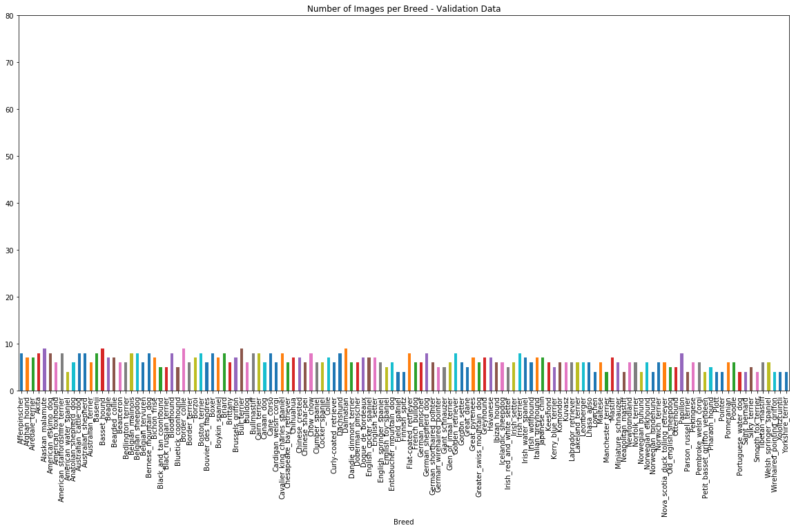
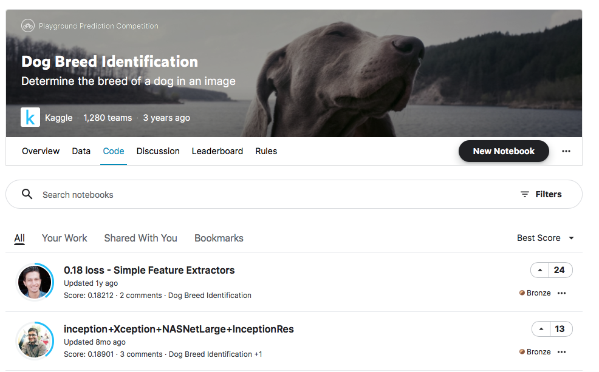

# Machine Learning Engineer Nanodegree
## Capstone Project
Ivan Jennings
September 19th, 2021

## I. Definition

### Project Overview
This project aims to detect dog breeds in a provided image using a convolutional neural network. There are many different image classifiers out there, including for animal breeds. Dog breeds present a challenge to determine specific breed, given that humans have intervened in the breeding resulitng in various different breeds and sub-breeds. Additionally, some different species of dog can look completly different. *"This domain is especially challenging since the appearance of corresponding parts can vary dramatically, e.g., the faces of bulldogs and beagles are very different."* *[1](#references)

### Problem Statement
In this project I aimed to create an accurate classifier which will determine first if the photo contains a human and/or dog, and then determine the breed of the dog or similar dog breed if a face is detected. Given the large data set and resources that would be needed to upload to the cloud and lack of these required resources, I won't be deploying this classifier as originally intented.

### Metrics
I will calculate accuracy of the detectors of human faces and dogs based on the total correctly detected images divided by the total predictions which should give us a result close to 100%. I will also calculate the accuracy of both the CNN models based on total correctly classified divided by the total classified. For the detector models, a simple accuracy is sufficient, however because the breed classifier is looking at multiple classes rather than a binary outcome, we will need to use another metric. Other metrics such as specificity and sensitivity would also not be ideal given that we are predicting multiple classes. I will use the loss calculation built into the scikit-learn library [4](#references) to compare against the kaggle models where the closer to zero, the better. Using a loss calculation would be ideal as each misclassification is penalised and there is no upper bound on the metric, meaning that the theoretical upper limit is infinite. [7](#references)

## II. Analysis

### Data Exploration
The data set that will be used for this project has been provided by Udacity and are available in the referenced links [2](#references). The dog data set containing 8351 colour images which will be used for classifying breeds, contains 3 folders each for training, test and validation sets. Each set contains a folder of photos for each of the 133 dog breeds. The sets are not balanced between dog breeds - test sets have been 3-10 images for each breed, training sets have between 26-77 images per breed and the validation set has between 4-9 images per breed. The images also have varying resolutions in JPG format. We also have a human face data set with 13233 colour images which will be used to train a model for determining if a human face is present in a photo - this set has a range of people with about 1 image per person, with up to 40+ images per person.

### Exploratory Visualization
Because there are 133 different dog breeds, it will be useful to visualise how many images we have per dog breed and data set (e.g. training, testing or validation) so that we can see if there is any particular breed that doesn't have enough images, or see if the distribution is even.

*Figure 1*

*Figure 2*

*Figure 3*

We can see that there is a reasonably even distribution between each set. The following plot also shows the distribution of resolutions within the set, which will be helpful to see what are the most common resolutions.

*Figure 4*

We can see in figure 4 that the majority of the images are between 200 x 200 and 800 x 600 resolution, which will be helfpul to know when selecting image transformations.

### Algorithms and Techniques
For the initial CNN model to classify dog breeds, I will start off with a simple mode from scratch using a small number of layers and epochs after which I can increase these to find an optimal model. For the transfer learning model, I will initially use the ResNet pre-trained model as this appears to be a popular one for this function after which I may try another model depending on the performance against the benchmarks. For the face detector, I will be using the OpenCV Haar feature-based classifier. Depending on the accuracy of the classifiers I may try others.

### Benchmark
The benchmark for the human and dog detector should be quite accurate - close to 100% correctly detected, however the differences between certain breeds can be quite subtle and thus more difficult to differentiate. The benchmark we will use for the classifier of breeds will be at least 10% for the initial CNN model written from scratch, and at least 60% accuracy for the CNN model using transfer learning. 

I will also compare with similar models that can be found on Kaggle [3](#references). The best model had a Multi Class Log Loss of 0.18 as seen in figure 5, which we can use to compare our model.

*Figure 5*

## III. Methodology

### Data Preprocessing
Based on the data exploration, for the dog breed images, there are varying resolutions for each image and between 27 - 77 images per breed. For the training data, I chose to use RandomResizeCrop to 224 x 224 as this will fit in with the rest of the architecture of the models. I also used RandomResizeCrop instead of Resize and CenterCrop so that if the training data is all formatted a certain way, then this will add in some noise to prevent overfitting.

### Implementation
There are two different classifers that were needed in this project, human face detector and a dog detector / breed classifier. The first classifier was the human face detector which I used the OpenCV Haar feature-based classifier (haarcascade_frontalface_alt.xml) this classifier gave 98% accuracy for human images (98% of human images had a face detected) and 83% accuracy for dog images (17% of dog images had a face detected). The second classifier was the dog detector and breed classifier. I used the VGG-16 pretrained model for the dog detector, which gave 100% accuracy for detecting a dog (0% of humans were detected as dogs, and 100% of dogs were detected as dogs).

For the initial CNN model that was created from scratch, I started off with 3 convolutional layers and 2 fully connected layers. The final fully connected layer's number of output features is 133 to match the number of dog breeds that we are trying to classify. I have used MaxPool2D to scale down the features accross the layers and I've used Dropout to help prevent overfitting. Based on the initial cross entropy loss, it was sitting around 4-5 and test accuracy was less than 10% with a fair amount of epochs. I also added in a scheduler to decay the learning rate after each 2 epochs, starting on the third epoch. 

The final model that I used, was a pretrained, transfer learning model through pytorch for the final classifier. The first pretrained model that I tested was the resnet50 as this seems to be a popular architecture for this type of project. Also using cross entropy loss, it came out at 0.64 with 81% test accuracy.

### Refinement
Because the human detector and the transfer learning model accuracy was well within the set out metrics, no further enhancements were made apart from adjusting the number of epochs for the transfer learning classifier. For the CNN model from scratch, the accuracy and loss was not within the set out metrics, so I experimented with a few different layer designs, finally finishing with the following model.

(conv1): Conv2d(3, 32, kernel_size=(3, 3), stride=(2, 2), padding=(1, 1))
(conv2): Conv2d(32, 128, kernel_size=(3, 3), stride=(2, 2), padding=(1, 1))
(pool): MaxPool2d(kernel_size=2, stride=2, padding=0, dilation=1, ceil_mode=False)
(fc1): Linear(in_features=25088, out_features=500, bias=True)
(fc2): Linear(in_features=500, out_features=133, bias=True)
(dropout): Dropout(p=0.2)

I found that two convolutional layers provided enough accuracy without needing a third layer, and the two fully connected layers were sufficient. The final model gave 3.7 test loss and 14% test accuracy which was above the 10% needed.

Model training was completed using AWS services, so there were no particular constraints on the GPU resources that were needed.

## IV. Results

### Model Evaluation and Validation
#### Human Face Detector
OpenCV Haar feature-based cascade classifier [5](#references)
There were no changes made to the human face detector model. This model gave sufficient accuracy.
Accuracy of the human detector was as follows:
Faces detected in images of humans: 98% of images (Target 100%)
Faces detected in images of dogs: 17% of images (Target 0%)

*Figure 6*

#### Dog Detector
VGG-16 trained on ImageNet [6](#references)

*Figure 7*

There were also no changes made to this pretrained model which gave the following accuracy

Dog detected in images of dogs: 100% of images (Target 100%)
Dog detected in images of humans: 1% of images (Target 0%)

#### Dog Breed Classifier
##### CNN from scratch

The final CNN architecture that was used had the following accuracy:

Correct breed detected: 124/836 (14%) (Target 10% +)
Test Loss: 3.78

##### CNN using transfer learning

The final CNN architecture that was used had the following accuracy:

Correct breed detected: 685/836 (81%) (Target 60% +)
Test Loss: 0.64

### Justification
All of the initial benchmarks were met, except the example that was shown on Kaggle for dog classification which had a much lower log loss at 0.18 compared to the 0.64 that was achieved here. Although there was more data available on the example on Kaggle and fewer dog breeds predicted.

## V. Conclusion

### Free-Form Visualization
With the final algorithm and solution complete, I tested it on a few images obtained off the web and using personal images. I found that the solution worked well and had real world accuracy.

*Figure 8*

Figure 8 was of a known dog and breed and the classifier accurately gave the output of no face, a dog detected and the correct breed.

*Figure 9*

Figure 9 was an image obtained of the web of a human, and it accuractly found a face and no dog. It is also interesting to see the dog breed that the person is most alike with.

### Reflection
The final algorithm consisted of two detectors, human and dog as well as a dog classifier. The initial data and detector algorithms were provided by Udacity in the initial notebook and workspace. I then tested the OpenCV and VGG16 models provided, before tweaking these with my own additions and adjustments. I created a function that tested the accuracy of various pretrained models before deciding on the final models for the detectors. After completing the detectors, I worked on the CNN from scratch and trained, tested and tweaked the parameters. Then I worked on the transfer learning model for the final dog classifier which was reasonably easy given that it was a pre-trained model. Finally, I created a function to put all of the detectors and classifier into one easy to use function and tested it on a few additional images as well. Initially I wanted to implement my own website with the final functions and trained models, however this proved to be difficult due as there was a large number of images that were used. And to transfer these to a different user, outside the workspace they were already uploaded to, would take a lot of resources.

### Improvement
As previously mentioned, I wanted to be able to use this algorithm on an online website, however this proved difficult due to the resources involved, or I else I would need to re-write a lot more code to be able to download and transfer the trained model and deploy it elsewhere. I could have also made a small gain by increasing the number of epochs on the transfer learning model to be able to get a higher accuracy. These were the two most impactful improvements that I could have done, but overall I was happy with the results.

### References

1\
[J. Liu, A. Kanazawa, D. Jacobs, and P. Belhumeur, “Dog Breed Classification Using Part Localization”, Computer Vision–ECCV 2012. Springer Berlin Heidelberg, 2012.](https://link.springer.com/chapter/10.1007/978-3-642-33718-5_13)

2\
[Dog dataset - Udacity](https://s3-us-west-1.amazonaws.com/udacity-aind/dog-project/dogImages.zip)\
[Human dataset - Udacity](http://vis-www.cs.umass.edu/lfw/lfw.tgz)

3\
[Dog breed identification](https://www.kaggle.com/c/dog-breed-identification/code)

4\
[Scikit-learn loss function](https://scikit-learn.org/stable/modules/generated/sklearn.metrics.log_loss.html)

5\
[Open CV Classifiers](https://github.com/opencv/opencv/tree/master/data/haarcascades)

6\
[Image Net](https://image-net.org)

7\
[Metrics to Evaluate your Machine Learning Algorithm](https://towardsdatascience.com/metrics-to-evaluate-your-machine-learning-algorithm-f10ba6e38234)
