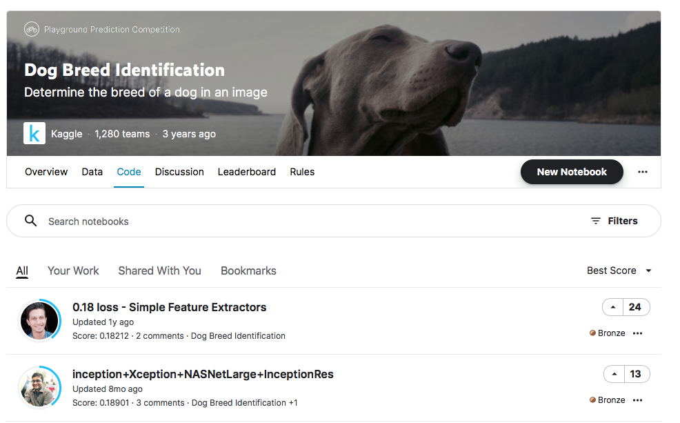

# Machine Learning Engineer Nanodegree
## Capstone Proposal
Ivan Jennings\
11 July 2021

## Proposal
Create a dog breed classifier that can be deployed for us on a mobile or web app for educational purposes.

### Domain Background
There are thousands of dog breeds all over the world many which are easily recognisable and also many variations of each breed. There are already existing classifiers available for use, however many of the applications are built for adult use. I would like to make the resulting classifier available for a younger audience to use as an educational tool.

### Problem Statement
As previously mentioned, there are many different dog breeds and variations. This project aims to create an accurate classifier which will determine first if the photo contains a human and/or dog, and then determine the breed of the dog. The model will be deployed so that it can be used in a mobile or web app.

### Datasets and Inputs
The data set that will be used for this project has been provided by Udacity and are available in the referenced links [1](#references). The dog data set, which will be used for classifying breeds, contains 3 folders each for training, test and validation sets. Each set contains a folder of photos (most have less than 10 photos) for each of the 133 dog breeds. We also have a human face data set which will be used to train a model for determining if a human face is present in a photo.

### Solution Statement
I will use the provided data sets to create classifiers which determine if a target photo contains a human or dog. And also a CNN which will determine, with proposed accuracy mentioned in the evaluation metrics below, which breed the dog is. Later I will also use transfer learning to increase the accuracy of the solution.

### Benchmark Model
The benchmark for the human and dog detector should be quite accurate - close to 100% correctly detected, however the differences between certain breeds can be quite subtle and thus more difficult to differentiate. The benchmark we will use for the classifier of breeds will be at least 10% for the initial CNN model written from scratch, and at least 60% accuracy for the CNN model using transfer learning. 

I will also compare with similar models that can be found on Kaggle [2](#references). The best model had a Multi Class Log Loss of 0.18 which we can use to compare our model.

### Evaluation Metrics
I will calcuate accuracy of the detectors of human faces and dogs based on the total correctly detected images divided by the total predictions which should give us a result close to 100%. I will also calculate the accuracy of both the CNN models based on total correctly classified divided by the total classified. In addition to this I will use the loss calculation built into the scikit-learn library [3](#references) to compare against the kaggle models.

### Project Design

The following is the basic workflow that I'll be using, of which the template is provided by Udacity. I will also deploy the algorithm to be used on a basic web app. 

Step 0: Import Datasets\
Step 1: Detect Humans\
Step 2: Detect Dogs\
Step 3: Create a CNN to Classify Dog Breeds (from Scratch)\
Step 4: Create a CNN to Classify Dog Breeds (using Transfer Learning)\
Step 5: Write your Algorithm\
Step 6: Test Your Algorithm\
Step 7: Deploy Algorithm using a Lambda function & RESTful API\
Step 8: Create basic web app to upload photo and show detected information

### References

1\
[Dog dataset - Udacity](https://s3-us-west-1.amazonaws.com/udacity-aind/dog-project/dogImages.zip)\
[Human dataset - Udacity](http://vis-www.cs.umass.edu/lfw/lfw.tgz)

2\
[Dog breed identification](https://www.kaggle.com/c/dog-breed-identification/code)

3\
[Scikit-learn loss function](https://scikit-learn.org/stable/modules/generated/sklearn.metrics.log_loss.html)